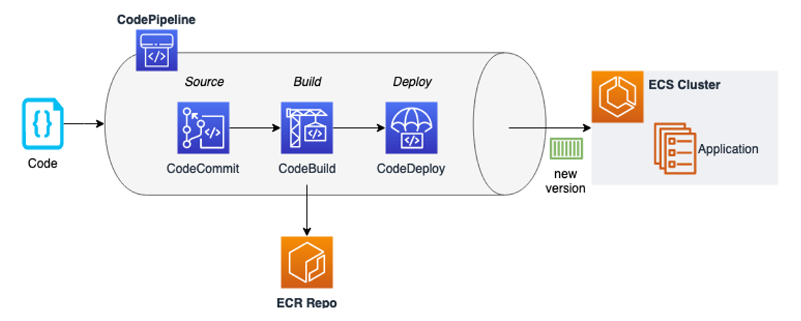

# DevOps Workshop AWS v1
AWS Workshop covering Devops Services

***Note: 
This version covers a Blue/Green Deployment scenario with AWS Fargate on Amazon ECS integrating the Code services (CodeCommit, CodeBuild, CodeDeploy and CodePipeline).
More updates to come. Stay tuned!***

*What we will cover*:
- Setup of a Cloud9 environment
- Deployment of required infrastructure including Amazon Elastic Container Service with Fargate and ECR repository
- Deploy and use a modernized pipeline using AWS CodePipeline, CodeBuild, and CodeBuild




Sources:
https://docs.aws.amazon.com/codecommit/latest/userguide/getting-started.html
https://docs.aws.amazon.com/codebuild/latest/userguide/getting-started.html
https://docs.aws.amazon.com/codedeploy/latest/userguide/getting-started-codedeploy.html
https://docs.aws.amazon.com/codepipeline/latest/userguide/tutorials-simple-codecommit.html
https://github.com/awslabs/aws-devops-essential

**Objective**: 
Quickly learn how to effectively leverage various AWS services to improve developer productivity and reduce the overall time to market for new product capabilities. 
In this session, we will demonstrate a prescriptive approach to incrementally adopt and embrace some of the best practices around continuous integration & delivery using AWS Developer Tools and 3rd party solutions including, AWS CodeBuild (a fully managed build service), CodePipeline (a fully managed continuous delivery service), and CodeDeploy (an automated application deployment service). 
We will also highlight some best practices and productivity tips that can help make your software release process fast, automated, and reliable.
**What we will cover**:
Setup of a Cloud9 environment
Deployment of Amazon Elastic Container Service with Fargate and ECR
Deploy and use a modernized pipeline using AWS CodePipeline, CodeBuild, and CodeBuild


## **Create a Workspace - AWS Cloud9 IDE - Setup**

AWS Cloud9 is a cloud-based integrated development environment (IDE) that lets you write, run, and debug your code with just a browser. It includes a code editor, debugger, and terminal. Cloud9 comes pre-packaged with essential tools for popular programming languages and the AWS Command Line Interface (CLI) pre-installed so you don't need to install files or configure your laptop for this workshop. Your Cloud9 environment will have access to the same AWS resources as the user with which you logged into the AWS Management Console.
Take a moment now and setup your Cloud9 development environment

### **Step-by-step Instructions**

1. Go to the AWS Management Console, click Services then select Cloud9 under Developer Tools.
2. Click **Create environment**.
3. Enter `MyDevEnvironment` into **Name** and optionally provide a Description.
4. Click **Next step**.
5. You may leave Environment settings at their defaults except the instance type. Make sure of changing it to launch a new **t3.small** EC2 instance instead of the **t2.micro** selected by default. ***Note* **Keep in mind that the instance will be paused after 30 minutes of inactivity. But don't worry, it will turn on when you access the workstation again!
    
6. Click **Next step**.
7. Review the environment settings and click **Create environment**. It will take several minutes for your environment to be provisioned and prepared.


**NOTE**: _In case of an error like “failed to create because the instance type t3.small isn't available in the requested Availability Zone” go back to the wizard and recreate environment in a supported AZ._

8. Once ready, your IDE will open to a welcome screen. Below that, you should see a terminal prompt similar to:


You can run AWS CLI commands in here just like you would on your local computer. Verify that your user is logged in by running the following command.

```bash
aws sts get-caller-identity
```

You'll see output indicating your account and user information:

```bash
{    
     "Account": "123456789012",    
     "UserId": "AKIAI44QH8DHBEXAMPLE",    
     "Arn": "arn:aws:iam::123456789012:user/user"
}
```

Keep your AWS Cloud9 IDE opened in a tab throughout this workshop as we'll use it for activities like cloning, pushing changes to repository and using the AWS CLI.

**Deploy pre-requisites**


1. Download the setup files, unzip and navigate to the setup directory:

```bash
curl -o setup.zip https://d2u1mnqz9x7eh0.cloudfront.net/setup.zip
unzip setup.zip
cd setup/
```

Here we are going to execute a setup script which will do the following:

* Install required tools and set required environment variables (current Region, Account ID, Repository URI, etc.)
* Create initial IAM roles
* Create ECR Repository and push sample application container image
* Create the required infrastructure for the workshop:
    * ECS cluster with Fargate
    * Application Load Balancer
    * Task definition
    * Networking: VPC, Public and Private Subnets, NAT Gateway
    * Sample Application Deployed

* Let's execute the setup script then!

```bash
chmod +x setup.sh
./setup.sh
```

This process will take several minutes as it need to deploy several resources which are dependent on each other in most cases, for example the ECS Service won't be created until the Load Balancer and it's Listener are created and configured.

Wait until **(STEP 9)** is set, meanwhile you can go to the [CloudFormation console](https://console.aws.amazon.com/cloudformation) to see how is it going.  Just click on the cloud9 logo (upper left corner) and select Go to your dashboard.


Example screens below:


Take a look at the Events tab to see the progress.


Once the devops-cluster stack reaches the CREATE_COMPLETE status, we can see that the template shows many outputs.


2. Once it finishes we can review if everything was setup as expected. Just go to the CloudFormation Outputs tab and click on the ExternalUrl link. The resulting website should look something similar like this:
    


As we can see, it is a simple web page that we are going to use during this exercise.

***Note*** We also get the URL as a final output from the setup script as well in the Cloud9 console. Either way we should access the same page.

If you walk through the *Resources* tab in CloudFormation, you will see what has been deployed, the key components that we can observe are: ECS Cluster, the Task Definition, the Service running 2 Tasks based on the definition and the Load Balancer with one listener and 2 target groups (one of them is not being used right now). Feel free to explore the different configuration that were done during the setup.

3. Ok, now we are ready to move on with the workshop itself. Let's get started!

### **Stage 1: Create an AWS CodeCommit Repository**

***To create the AWS CodeCommit repository (console)***

1. Open the AWS CodeCommit console at https://console.aws.amazon.com/codecommit.
2. On the Welcome page, choose Get Started Now. (If a ***Dashboard*** page appears instead, choose ***Create repository***.)
3. On the ***Create repository*** page, in the ***Repository name*** box, type ***My**Repo***.
4. In the ***Description*** box, type ***My demonstration repository***.
5. Choose ***Create repository*** to create an empty AWS CodeCommit repository named ***MyRepo***.

***Note*** The remaining steps in this tutorial assume you have named your AWS CodeCommit repository ***MyRepo***. If you use a name other than ***MyRepo***, be sure to use it throughout this tutorial. For more information about creating repositories, including how to create a repository from the terminal or command line, see [Create a Repository](http://docs.aws.amazon.com/codecommit/latest/userguide/how-to-create-repository.html).


### **Stage 2: Clone the Repo**

In this step, you will connect to the source repository created in the previous step. Here, you use Git to clone and initialize a copy of your empty AWS CodeCommit repository. Then you specify the user name and email address used to annotate your commits.
First, let's install the git-remote-codecommit (GRC) utility, which will assist us with authenticating to CodeCommit. Run the following from the Cloud9 terminal prompt:


```bash
cd ~/environment
pip install --user git-remote-codecommit
```

Now do the following to clone the repository:

1. From CodeCommit Console, go to your repository. Click on the **Clone URL** dropdown and then choose **Clone HTTPS (GRC)**. The URL will be copied to your clipboard. 

 

2. Go to Cloud9 IDE terminal prompt

3. Run git clone to pull down a copy of the repository into the local repo, using the URL copied above. It should be something like this <YOUR-REGION> will reflect the current region you are in, for example if you are in N. Virginia it will say us-east-1:

```bash
git clone codecommit::<YOUR-REGION>://MyRepo
```

You would be seeing the following message if cloning is successful. ***warning: You appear to have cloned an empty repository.***


## **Stage 3: Upload app code to the repo**


1. Copy all the relevant ***contents*** of the SampleApp folder to your local repo folder.

```bash
cp ~/environment/setup/SampleApp/index.html ~/environment/setup/SampleApp/AWS_logo.png MyRepo/
```

After copying the files, your local repo should look like the one below. 


2. Change the directory to your local repo folder. Run ***git add*** to stage the change:


```bash
cd ~/environment/MyRepo
git add *
```

3. Run ***git commit*** to commit the change:


```bash
git commit -m "Initial Commit"
```

***💡 Tip*** To see details about the commit you just made, run ***git log***.


4. Run ***git push*** to push your commit through the default remote name Git uses for your AWS CodeCommit repository (origin), from the default branch in your local repo (master):

```bash
git push -u origin master
```

***💡 Tip*** After you have pushed files to your AWS CodeCommit repository, you can use the [AWS CodeCommit console](https://console.aws.amazon.com/codecommit/home) to view the contents.
For more information, see [Browse the Contents of a Repository](http://docs.aws.amazon.com/codecommit/latest/userguide/how-to-browse.html).
* * *

***💡 Tip* ***How to see the Commit Id?*

You can see all the commits to the repository easily. From the CodeCommit console go to Repositories > Commits.

You will see a screen similar to this one:


As you see, we have the initial commit we executed. If you need the commit ID for reference click on Copy ID action on the right.

If you click on the Commit ID link you will be able to find more details on what has changed and leave comments. You can also Copy the Commit ID from here.


## **Stage 4: Create required IAM Roles**


1. First, let us create the necessary roles required to finish labs. Run the CloudFormation stack to create service roles. Ensure you are launching it in the same region as your AWS CodeCommit repo.

```bash
aws cloudformation create-stack --stack-name DevopsWorkshop-roles --template-body https://d2u1mnqz9x7eh0.cloudfront.net/01-aws-devops-workshop-roles.template --capabilities CAPABILITY_IAM
```

***💡 Tip*** To learn more about AWS CloudFormation, please refer to [AWS CloudFormation UserGuide.](https://docs.aws.amazon.com/AWSCloudFormation/latest/UserGuide/Welcome.html)

2. Upon completion take a note on the service roles created. Check [describe-stacks](http://docs.aws.amazon.com/cli/latest/reference/cloudformation/describe-stacks.html) to find the output of the stack.
3. For Console, refer to the CloudFormation [Outputs tab](http://docs.aws.amazon.com/AWSCloudFormation/latest/UserGuide/cfn-console-view-stack-data-resources.html) to see output. ***Sample Output:*** 
    


## **Stage 5: Creating the Pipeline**

### ***5.1 Prepare the build specs (build container image from source)***

We are going to work on the building stage. During the latter we will be creating a container image with the web application and pushing it to the Container Registry for later use by the Deployment phase.

Let's begin with the requirements first:

1. Copy the Docker configuration file to the repository: 

```bash
cp ~/environment/setup/SampleApp/Dockerfile ~/environment/MyRepo/
```

2. Let's inspect the Dockerfile quickly with **more** command:

```bash
more ~/environment/MyRepo/Dockerfile
```


As you can see, this is a really simple container configuration file in which we use ngnix as a base image and instruct to copy the web app files to nginx default route.

3. Push the Dockerfile to the Code Commit Repo:

```bash
git add Dockerfile
git commit -m "Adding Docker configuration file"
git push -u origin master
```

Now let's work on the build spec:

A build spec is a collection of build commands and related settings in YAML format, that AWS CodeBuild uses to run a build. 

First you need to get the value for your ECR repo running the following commands.

```bash
export AWS_ACCOUNT_ID=$(aws sts get-caller-identity --query Account --output text)
export ECR_REPOSITORY=$AWS_ACCOUNT_ID.dkr.ecr.us-east-1.amazonaws.com/devops-workshop-app
echo $ECR_REPOSITORY
```


You can also go to the ECR console and copy the URI of the repository (remember it is just the repository name, without tags).  To know more about [how CodeBuild works](http://docs.aws.amazon.com/codebuild/latest/userguide/concepts.html#concepts-how-it-works).

Now, create a file named, ***buildspec.yaml*** under My**Repo** folder. Copy the content below to the file, replacing <REPO_URI> with the value generated for your ECR repo (echo $ECR_REPOSITORY) and **save** it.

```bash
version: 0.2

phases:
  pre_build:
    commands:
      - echo Logging in to Amazon ECR...
      - aws --version
      - $(aws ecr get-login --region $AWS_DEFAULT_REGION --no-include-email)
      - REPOSITORY_URI=<REPO_URI>
      - COMMIT_HASH=$(echo $CODEBUILD_RESOLVED_SOURCE_VERSION | cut -c 1-7)
      - IMAGE_TAG=build-$(echo $CODEBUILD_BUILD_ID | awk -F":" '{print $2}')
  build:
    commands:
      - echo Build started on `date`
      - echo Building the Docker image...
      - docker build -t $REPOSITORY_URI:latest .
      - docker image tag $REPOSITORY_URI:latest $REPOSITORY_URI:$IMAGE_TAG
  post_build:
    commands:
      - echo Build completed on `date`
      - echo Pushing the Docker images...
      - docker push $REPOSITORY_URI:latest
      - docker push $REPOSITORY_URI:$IMAGE_TAG
      - printf '{"ImageURI":"%s"}' $REPOSITORY_URI:$IMAGE_TAG > imageDetail.json
artifacts:
  files: 
      - 'image*.json'
      - 'appspec.yaml'
      - 'taskdef.json'
  secondary-artifacts:
      DefinitionArtifact:
          files:
              - appspec.yaml
              - taskdef.json
      ImageArtifact:
          files:
              - imageDetail.json
```


The buildspec with the replacement should look similar to this:


In this Build Specification, we can find the following structure:

* BuildSpec version: This value should not be changed.

* Pre-build phase: During this phase, we are instructing CodeBuild to enable a login session with ECR registry, get the first 7 characters of the Commit ID (from CodeCommit) on COMMIT_HASH and the Build ID (from CodeBuild), those are optional steps but give you valuable information to add to your new Container image, so you could improve the traceability of your builds with the source code changes.

* Build phase: It will create the Container Image and tag it with the image tag generated during pre-build phase. 

* Post-build phase: The built image is pushed to ECR repo during this phase. (We are pushing the image with latest and with the custom tag which we could use for traceability). We are also creating a file called imageDetail.json containing the Image URI info which is a requirement for our Deployement stage.

* Artifacts: In this section we are specifying the files that we need to generate as Output Artifacts which will be served as input for the deployment phase. AppSpec and TaskDef files provide required definitions for creating replacement tasks for deployments while imageDetail provide the image URI to be used.


***Note*** Visit this [page](http://docs.aws.amazon.com/codebuild/latest/userguide/build-spec-ref.html) to know more about build spec and how you can use multiple build specs in the same repo.

### 4. Commit & push the build specification file to repository

```bash
git add buildspec.yaml
git commit -m "adding buildspec.yaml"
git push -u origin master
```

***Challenge*** How would you look into the Commit ID?

### ***5.2. Prepare the application deployment specs:***

We now need to work on the Deployment Stage specs. During this phase we are going to update the task running our web application on Amazon ECS, yes... just as simple as that!

An application specification file (AppSpec file), which is unique to CodeDeploy, is a [YAML](http://www.yaml.org/)-formatted or [JSON](http://www.json.org/)-formatted file. 

The AppSpec file is used to manage each deployment as a series of lifecycle event hooks, which are defined in the file.
For information about how to create a well-formed AppSpec file, see [CodeDeploy AppSpec File reference](https://docs.aws.amazon.com/codedeploy/latest/userguide/reference-appspec-file.html).

Create a file named ***appspec.yaml*** under *MyRepo* folder. 

Copy the content below, *DO NOT REPLACE <TASK_DEFINITION>*, leave the text as is as it will be required by CodeDeploy to dynamically adjust the TASK_DEFINITION value. 

The latter is because with each new container image we get a new revision of the task definition, for example: if the revision was webapp:2, after pushing the newly built image we will have a new revision webapp:3. In normal conditions we would need to update the taskdefinition value in some way, most likely manually or with complex scripts. In this case CodeDeploy will do the magic for us.


```bash
version: 0.0
Resources:
  - TargetService:
      Type: AWS::ECS::Service
      Properties:
        TaskDefinition: <TASK_DEFINITION>
        LoadBalancerInfo:
          ContainerName: "webapp"
          ContainerPort: 80
```

In this AppSpec configuration, along with the Task Definition we are giving the information of the container name we are updating and the container port as well. 

This is a quite simple file, you can explore cooler features like the AppSpec hooks in order to execute functions during the different stages of the new deployment to achieve more advanced objectives, for example: stop certain tasks from executing before the deployment, perform validations before shifting traffic to new task, perform validations after deployment, etc. 

For more information about AppSpec hooks you can check the [documentation](https://docs.aws.amazon.com/codedeploy/latest/userguide/reference-appspec-file-structure-hooks.html).
          
 Now, let's push the appspec.yaml to our repo!     

```bash
git add appspec.yaml
git commit -m "Adding AppSpec"
git push -u origin master
```

Now let's export the task definition from ECS, as we will need it for the Deployment phase. Go to [Task Definition section on ECS Console](https://us-east-1.console.aws.amazon.com/ecs/home#/taskDefinitions). We can copy the content and paste it to a new file in Cloud9 and call it taskdef.json.

We can also achive this programatically through the command line running the following commands:

```bash
export TASK_DEFINITION=$(aws ecs list-task-definitions | jq -r '.taskDefinitionArns[0]')

aws ecs describe-task-definition --task-definition $TASK_DEFINITION \
--query "taskDefinition.{family:family, taskRoleArn:taskRoleArn, executionRoleArn:executionRoleArn, networkMode:networkMode, containerDefinitions:containerDefinitions, volumes:volumes, placementConstraints:placementConstraints, requiresCompatibilities:requiresCompatibilities, cpu:cpu, memory:memory, tags:tags, pidMode:pidMode, ipcMode:ipcMode, proxyConfiguration:proxyConfiguration}" | jq 'del(.[] | nulls)' > taskdef.json

```

Regardless on how the taskdef.json file is created, we need to change the following line:

```bash
"image": "<accountID>.[dkr.ecr.us-east-1.amazonaws.com/webapp-:latest](http://dkr.ecr.us-east-1.amazonaws.com/webapp-%3CaccountID%3E:latest)",
```

to:

```bash
"image": "<IMAGE1_NAME>",
```

* * *
Why was that? Well, by the same principle we left a generic placeholder value on the appspec file we are doing the same on the task definition file, this is because the image name will change as well so, again, CodeDeploy will handle the dynamic update of this value each time it pushes a new revision based on the settings of the taskdef.json file.
***

Now, let's push the taskdef.json to our repo!     

```bash
git add taskdef.json
git commit -m "Adding TaskDef"
git push -u origin master
```


Now, we are going to create the required configurations on CodeDeploy to use later on our pipeline. Let's go to [*CodeDeploy Console*](https://us-east-1.console.aws.amazon.com/codesuite/codedeploy/applications?region=us-east-1)and click on *Create application*. 


1. Under application name choose a name for the application, for example: *devops-workshop-MyWebApp*.

2. Choose *Amazon ECS* under Compute platform.

3. Click on *Create application*.

4. Now we are going to create a ***Deployment group****.* Click on *Create deployment group button*.

5. Under *Deployment group name* write a name to identify the deployment group. For example: devops-workshop-webapp-dg.

6. Under Service Role choose the role we created for CodeDeploy earlier.

7. Under *Environment configuration* choose:

    + ECS cluster name: ecs-devops-workshop

    + ECS service name: devops-cluster-Service-XXXXXXX (webapp-svc)

8. Under *Load balancers* choose:
    + Load balancer: alb-devops-workshop

    + Production listener port: HTTP: 80

    + Target group 1 name: ecs-devops-webapp-TG

    + Target group 2 name: ecs-devops-webapp-TG-tmp

9. Under *Deployment settings* leave *Reroute traffic immediately* option selected, leave the defaults in Deployment configuration and change the time for *Original revision termination* from 1 hour to 5 minutes. This is because, for the purpose of this lab, we don't want to be waiting 1 hour to confirm the update of the environment, in real world we would need to choose the revision time wisely.


10. Click on *Create deployment group*.


### ***5.3 Create the Pipeline (at last!)***

Now, it is time to tie together all we have been doing so far. Go to the [CodePipeline Console](https://us-east-1.console.aws.amazon.com/codesuite/codepipeline/start) and click on *Create Pipeline* button.

***Pipeline Settings***

1. On Pipeline name write a name to identify your pipeline. For example: *MyFirstPipeline*.
2. On Service Role choose *Existing service role* and on the search box under RoleARN you should see the role we created for CodePipeline earlier. Choose it and then click *Next*.


***Add source stage***

1. Choose *AWS CodeCommit* from the Source provider list
2. Under Repository name choose *MyRepo*
3. On *Branch name* choose *master*.
4. Leave the defaults on the rest and click on *Next*.


***Add build stage***


1. Under Build provider choose *AWS CodeBuild* and make sure the correct region is selected.

2. Under Project name click on *Create project* to open a popup window to create the project we will use for this stage.

3. Inside the popup window, write a Project name, for example: *MyFirstBuild.* You can write a Description as well. Keep scrolling down until you reach the ***Environment*** section.

4. Leave *Managed image* option selected and select Amazon Linux 2 from the list. And then choose the following:
    + Runtime(s): Standard

    + *Image*: aws/codebuild/amazonlinux2-x86_64-standard:3.0
    + *Image version*: Always use the latest image for this runtime version
    + *Environment type*: Linux
    + Mark *Privileged* checkbox to enable building Docker images.
    + Under *Service Role*, choose *Existing service role* and choose the role we created for CodeBuild earlier.
    + Expand *Additional configuration* and scroll down to VPC. Choose the VPC tagged as prod and different to the default.
    + Choose the PrivateSubnets One and Two. 
    + Choose the Container security group as well.
    + Leave the defaults for the rest of the section.
5. Under *BuildSpec*, leave *Use a buildspec file* option selected. 
6. Under *Logs*, leave CloudWatch Logs marked. Write down *devops-workshop* as Group name and webapp as Stream name.
    


1. Click on *Continue to CodePipeline* to return to the CodePipeline console. The Project name will be populated automatically. Click on *Next*.


***Add deploy stage***


1. Choose *Amazon ECS (Blue/Green)* from the *Deploy provider* list. Make sure the correct Region is selected.
2. Under *AWS CodeDeploy application name* choose the application we created earlier devops-workshop-MyWebApp.
3. Under *AWS CodeDeploy deployment group* choose the Deployment Group we created earlier *devops-workshop-dg*.
4. Under Amazon ECS task definition choose: *BuildArtifact* and taskdef.json
5. Under AWS CodeDeploy AppSpec file choose: *BuildArtifact* and appspec.yaml
6. Under Dynamically update task definition image choose: *BuildArtifact* and write *IMAGE1_NAME* as a placeholder. This will allow CodeDeploy to update the task definition image. Click Next.


7. Click on *Next*.

Alright! Everything set, let's click on *Create pipeline*. A pipeline automatic execution will take place. Choose *Stop execution*  - Stop and Abandon to prevent it for running for now. 
You can let it run anyway to validate there are no errors during the pipeline execution. There would be no changes to the application as we haven't edited the code yet.

### ***5.4 Test the pipeline (upload the updated app code)***

Finally, we have reached the final stage of this workshop, we will update the application code, push the code to codecommit and see how the Pipeline actually works through the stages to deploy the new application version.

Let's update the code:


1. In Cloud9 environment, open index.html under MyRepo folder on the file explorer at the left of the screen.

2. Change line 21 from:

```bash
<h1><strong>Executing v1 on AWS Fargate</strong></h1>
```

to:

```bash
<h1><strong>Executing v2 on AWS Fargate. Courtesy of Code Suite!</strong></h1>
```

3 Save and push the updated HTML to the CodeCommit repository. 

```bash
git add index.html
git commit -m "Updated Web App to v2"
git push -u origin master
```

4. Go to the CodePipeline console and open the pipeline we created earlier you will see that the pipeline is in progress.
    


5. The pipeline should move forward Stage by Stage and you can validate each of the steps through the logs and Details for each.

Let's take a look...

***Source***


The Source stage will output the first characters of the Commit ID.

Clicking directly on the Commit ID will direct us to the specific Commit details in the Code Commit Console.

You can see the commit comment we wrote is reflected here.

***Build*** 


Click in Details to watch a full log for the whole building process.

We can see this as a tail log during the stage execution.

The log shows the result of running the set of commands and instructions from buildspec.yaml file.

Take a moment to review the logs from the build and compare it with the buildspec.yaml we have created. At the end you should see an output similar to this one:


We can see that the build process was able to generate the 3 necessary artifacts for the next stage.

Before moving on, let's check on ECR shall we? If you go to the console and explore the webapp repository you will see something similar to this:


Notice the two image tags (latest and build ID)? That is exactly as we instructed in the buildspec.yaml file.

***Deployment***

Let's move to the final stage and click on Details. We will be taken to CodeDeploy console, particularly to the Deployment dashboard.

During the deployment we will see something similar to the images below:


CodeDeploy will create a new Task Definition version (based on the provided taskdef.json file). Then, based on that, it will create a new set of tasks.


Once the tasks are ready it will shift the traffic to the new tasks.


CodeDeploy will leave a timer defined during the Deployment Group configuration to allow any set of manual tests and validations we might need. We can stop the deployment, stop and trigger a roll back or simply terminate the original task set. 

Now let's check if the application was updated...


***
There it is! **Congratulations!** We created a basic pipeline from scratch to deliver updates to our web application just by uploading the code to the repository.
***
